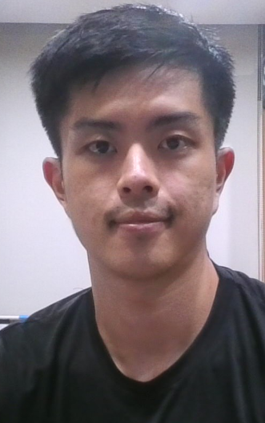
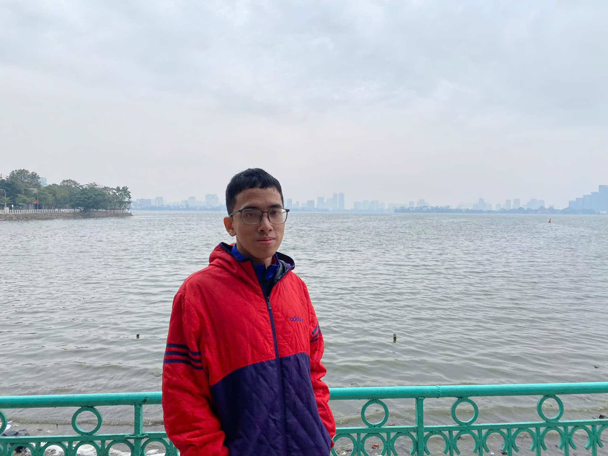
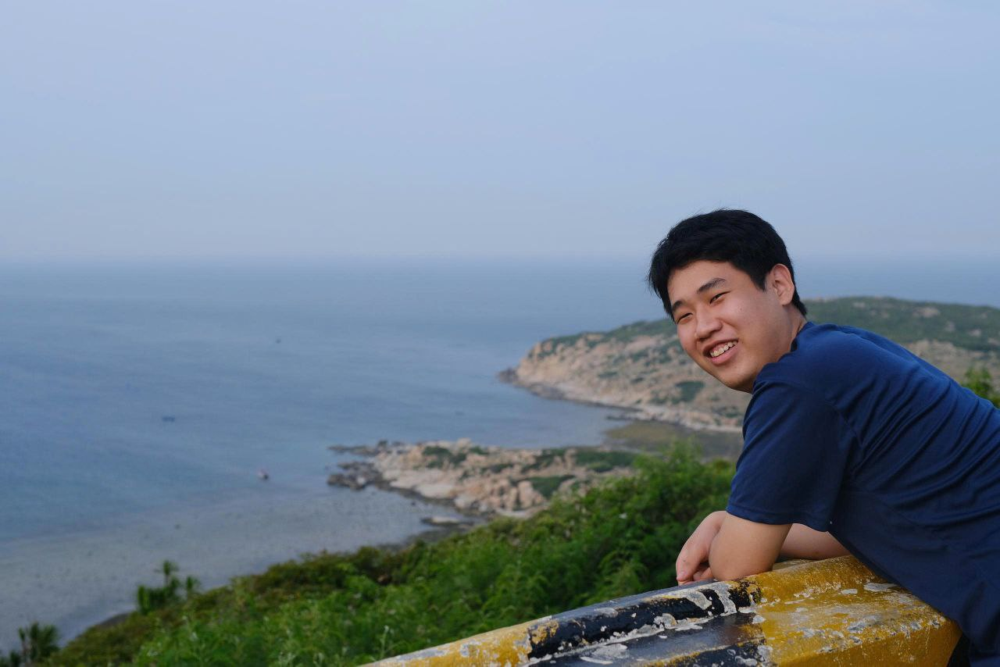
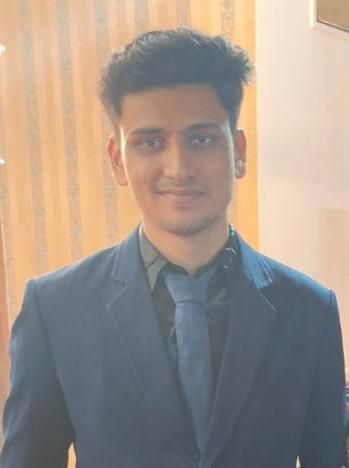

# About Us

We are a team based in the [School of Computing, National University of Singapore](http://www.comp.nus.edu.sg).

You can reach us at the email `seer[at]comp.nus.edu.sg`

## Project team

### Cyrus Low

[[github](https://github.com/crimsonchaos02)]
[[portfolio](team/crimsonchaos02.md)]

* Role: Project Advisor

### Tan Jun Xiang

[[github](https://github.com/0rbita1)]
[[portfolio](team/0rbita1.md)]

* Role: Developer
* Responsibilities: UI

### Tran Bao Duy

[[github](http://github.com/Duyy0406)] [[portfolio](team/duyy0406.md)]

* Role: Developer
* Responsibilities: Data

### Tieu Trong Phuc

[[github](http://github.com/tieutrongphuc)]
[[portfolio](team/tieutrongphuc.md)]

* Role: Developer
* Responsibilities: Testing

### Aryan Sharma

[[github](https://github.com/Aryann-Sharma)]
[[portfolio](team/aryan.md)]

* Role: Developer
* Responsibilities: UI
